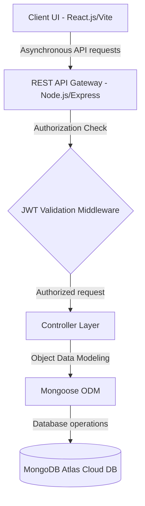

# ShopEZ 🛍️ — Full Stack MERN E-Commerce Project Documentation

Welcome to the comprehensive project documentation for **ShopEZ**, a modern, lightweight, and high-performance e-commerce platform built using the MERN stack (MongoDB, Express, React, Node.js). 

This document consolidates the end-to-end planning, analysis, design, development, and testing phases of the ShopEZ application, strictly reflecting the requirements, architecture, and implementations within the project.

---

## 📋 Table of Contents
1. [Introduction & Project Overview](#1-introduction--project-overview)
2. [Target Audience & Problem Statements](#2-target-audience--problem-statements)
3. [User Experience & Empathy Mapping](#3-user-experience--empathy-mapping)
4. [Problem-Solution Fit & Unique Value Proposition](#4-problem-solution-fit--unique-value-proposition)
5. [System Architecture & MVC Pattern](#5-system-architecture--mvc-pattern)
6. [Database Schema & Isolated Collections](#6-database-schema--isolated-collections)
7. [Requirements Specifications (FRs & NFRs)](#7-requirements-specifications-frs--nfrs)
8. [Product Backlog, User Stories & Sprint Planning](#8-product-backlog-user-stories--sprint-planning)
9. [Technology Stack & System Characteristics](#9-technology-stack--system-characteristics)
10. [Local Development Setup & Execution](#10-local-development-setup--execution)
11. [API Endpoint Documentation](#11-api-endpoint-documentation)
12. [User Acceptance Testing (UAT) & Bug Tracking](#12-user-acceptance-testing-uat--bug-tracking)
13. [Known Issues & Future Enhancements](#13-known-issues--future-enhancements)

---

## 1. Introduction & Project Overview

### 1.1 Project Title
**ShopEZ — Modern MERN Stack E-Commerce Platform**

### 1.2 Development Team & Roles
*   **Venu (Individual)**: Lead Full-Stack Developer & Database Architect
    *   *Responsibilities*: End-to-end React UI development, Express REST API engineering, decoupled MongoDB database design, and role-based access control (RBAC).

### 1.3 Project Purpose
ShopEZ is designed to lower the barrier to digital transformation for small-to-medium retail enterprises (SMEs) by providing a lightweight, self-hosted, high-performance e-commerce software suite. It addresses critical industry pain points:
*   **Reducing cognitive load** caused by bloated, generic administrative panels in traditional platforms.
*   **Eliminating interface clutter** by dynamically rendering form inputs and product pages depending on the product type (e.g., apparel vs. electronics).
*   **Preventing shopping cart abandonment** due to dropped session states across page refreshes and browser closures.

---

## 2. Target Audience & Problem Statements

### 2.1 Sarah's User Scenario: The ShopEZ Experience in Action
*   **Context**: Sarah is a busy professional who needs to find a birthday gift for her best friend Emily, who loves fashion accessories. With a hectic schedule, she cannot afford to spend hours browsing bloated websites.
*   **Action & Solution**:
    1.  **Effortless Discovery**: Sarah opens ShopEZ and navigates to the Fashion Accessories category. She refines the list quickly using category-aware filters.
    2.  **Personalized Recommendations**: As she scrolls, she receives a tailored list of similar items based on the category she is browsing. She finds a gold bangle that matches Emily's taste and adds it to her cart.
    3.  **Seamless Checkout**: Sarah completes the purchase in under two minutes with an integrated checkout form, local currency support (INR - ₹), and an automatic order summary.
    4.  **Instant Notification**: Sarah receives a confirmation email, securing peace of mind.
    5.  **Admin Fulfilment**: The local seller receives an order notification on the backend admin dashboard, prepares the shipment, and generates a printable invoice with a single click.

### 2.2 Customer & Merchant Problem Statements

| ID | Actor | Needs to... | Obstacles Encountered | Resulting Emotion |
|---|---|---|---|---|
| **PS-1** | Busy, Tech-conscious Shopper | Browse, select, and purchase household goods, clothes, and electronics in INR (₹) using a single unified storefront. | Encounter cluttered, slow-loading websites that require redundant inputs and lose cart data on page refresh. | Frustrated, impatient, and apprehensive; ultimately leads to cart abandonment. |
| **PS-2** | SME Business Owner | Manage online product inventory efficiently, and print clean, professional order invoices. | Forced to navigate complex admin dashboards, fill out irrelevant fields (e.g. apparel sizes for electronics), and print clunky browser screenshots. | Overwhelmed, exhausted by overhead, and frustrated by administrative time theft. |

---

## 3. User Experience & Empathy Mapping

To ensure ShopEZ satisfies real user behaviors and limitations, the design system was structured using an **Empathy Map Canvas**:

*   **Think and Feel**:
    *   *Worries*: "Will my cart empty itself if I close this tab?", "Is my checkout session secure?", "Am I ordering the correct size?"
    *   *Aspirations*: A clean, aesthetic storefront that feels premium, loads instantly, and holds its state.
*   **Hear**:
    *   *Friends/Colleagues*: "Stick to minimalist apps; they load instantly on slow networks."
    *   *Accounting*: "Ensure you download a clean invoice receipt for reimbursement."
*   **See**:
    *   *Environment*: Bloated legacy e-commerce sites packed with popups, endless sliders, and complex registration steps.
*   **Say and Do**:
    *   *Behavior*: Dislikes inputting redundant information. Will immediately abandon the cart if forced to fill out long, multi-step forms or size grids for static products.
*   **Pains**:
    *   Dropdown sizing arrays displaying on non-apparel items.
    *   Losing cart items and redirect loops after logging in.
*   **Gains**:
    *   Instant currency calculations (₹), under-two-minute checkout, and clean downloadable invoice layouts.

---

## 4. Problem-Solution Fit & Unique Value Proposition

| Customer Behavior & Constraints | ShopEZ Platform Solution |
|---|---|
| **Low Cognitive Budget**: Shopping during short breaks on mobile devices requires simplicity and fast responsiveness. | **Context-Aware Category Adaptation**: Product details pages dynamically alter their layout based on category. Sizing grids are hidden for non-apparel items (Electronics, Home Decor). |
| **High Cart Abandonment**: Shoppers leave when cart contents are lost on refresh, device swap, or login redirects. | **Persistent Shopping State**: Prevents lost sessions by synchronizing client-side local cache storage directly to the React Context API. |
| **Admin Accounting Bottlenecks**: SME owners struggle to print clean receipts, often printing web layouts with background colors. | **Isolated Invoice Printing**: Integrates specialized CSS print rules (`@media print`) to strip admin sidebars, navbars, and buttons, leaving a clean, standard layout. |

---

## 5. System Architecture & MVC Pattern

ShopEZ utilizes a decoupled MERN stack architecture designed for modularity, horizontal scaling, and zero-privilege security access.



### 5.1 MVC Pattern Separation of Concerns
*   **Model Layer (`/server/models`)**: Enforces schema rules and handles database interactions using Mongoose ODM.
*   **Controller Layer (`/server/controllers`)**: Directs business logic processing. Receives client HTTP requests, validates inputs, commands Model operations, and returns structured JSON responses.
*   **View Layer (REST Routes `/server/routes`)**: Defines API routing endpoints and hooks them to custom middleware and controller functions. (The visual user view is fully decoupled and rendered as a Single Page Application by React).

---

## 6. Database Schema & Isolated Collections

To prevent **Privilege Escalation Vectors**, ShopEZ features a completely decoupled collection structure. Admins and standard Customers are stored in isolated collections, meaning administrator security variables (such as permission scopes and audit logs) are never exposed to customer API queries.

### 6.1 Mongoose Schemas

#### 1. User Schema (`/server/models/User.js`)
Stores customer parameters, including sub-document schema arrays for shipping addresses and tokenized payment settings.
*   `username` (String, Required)
*   `email` (String, Required, Unique)
*   `password` (String, Required, Hashed via bcrypt)
*   `shippingAddresses` (Array of sub-documents)
*   `savedPaymentMethods` (Array of token structures)

#### 2. Admin Schema (`/server/models/Admin.js`)
An isolated collection handling role-based access control (RBAC), specific permission flags, failed login attempts (brute-force prevention), and an internal sub-document audit log array.
*   `username` (String, Required)
*   `email` (String, Required, Unique)
*   `password` (String, Required, Hashed via bcrypt)
*   `role` (String, default: `'admin'`)
*   `permissions` (Array of Strings, e.g., `['manage_catalog', 'manage_orders']`)
*   `failedAttempts` (Number, default: `0`)
*   `auditLog` (Array of sub-documents: `action`, `timestamp`, `ipAddress`)

#### 3. Product Schema (`/server/models/Product.js`)
Represents products in the catalog, with flexible fields handling category-aware data dynamically.
*   `name` (String, Required)
*   `description` (String, Required)
*   `price` (Number, Required, in ₹)
*   `category` (String, Required: `'Fashion' | 'Electronics' | 'Home Decor'`)
*   `sizes` (Array of Strings, optional: e.g., `['S', 'M', 'L']` - only queried/used for Fashion)
*   `stock` (Number, Required, default: `0` - acts as a single input for Electronics/Decor)
*   `image` (String, image URL path)

#### 4. Cart Schema (`/server/models/Cart.js`)
Stores temporary shopping baskets synced to user accounts.
*   `userId` (ObjectId referencing `'User'`, Required)
*   `items` (Array of sub-documents: `productId`, `name`, `quantity`, `size`, `price`)

#### 5. Order Schema (`/server/models/Order.js`)
Represents finalized transactions with structured status fields.
*   `userId` (ObjectId referencing `'User'`, Required)
*   `items` (Array of sub-documents: `productId`, `name`, `quantity`, `size`, `price`)
*   `totalAmount` (Number, Required)
*   `shippingAddress` (Object)
*   `paymentStatus` (String, default: `'Pending'`)
*   `orderStatus` (String, default: `'Processing' | 'Shipped' | 'Delivered' | 'Cancelled'`)
*   `createdAt` (Date, default: `Date.now`)

---

## 7. Requirements Specifications (FRs & NFRs)

### 7.1 Functional Requirements

*   **FR-1: Authentication & Security**: Guest accounts can register with email verification. Users log in securely to receive a stateless JSON Web Token (JWT). API routes are protected based on token roles.
*   **FR-2: Adaptive Product Catalog**: Storefront product details pages read the product category and dynamically hide clothing size interfaces for Electronics and Decor.
*   **FR-3: Cart & Ordering**: Preserves cart states in browser local storage and syncs it with the customer database upon login. Handles order placement, validation, and shipping address logging.
*   **FR-4: Admin Cockpit**: Provides real-time analytical widgets summarizing total revenue, order counts, and registered user base. Supports full CRUD control over the product catalog.
*   **FR-5: Reporting & Invoicing**: Admins can export transaction datasets to a clean `.csv` spreadsheet and open a clean invoice print modal stripped of dashboard layouts.

### 7.2 Non-Functional Requirements

| ID | Requirement Type | Description |
|---|---|---|
| **NFR-1** | Usability | The storefront user interface must be 100% fluid and responsive across mobile, tablet, and desktop layouts using CSS framework rules. |
| **NFR-2** | Security | User passwords must be hashed using bcrypt. Sensitive API endpoints must validate JWT roles, returning 403 Forbidden on authorization breaches. |
| **NFR-3** | Reliability | Database writes must require Mongoose schemas validations. Uncaught backend failures must return standardized error JSON objects (500) rather than crashing the node process. |
| **NFR-4** | Performance | API response times must remain under 500ms. Frontend JS packages must be minimized through build bundle treeshaking, remaining under 300KB. |
| **NFR-5** | Availability | Uptime target of 99.9% achieved using managed cloud database failovers (MongoDB Atlas) and globally cached CDN networks (Vercel CDN). |
| **NFR-6** | Scalability | Stateless architecture ensures instances can scale horizontally behind reverse proxy load balancers. |

---

## 8. Product Backlog, User Stories & Sprint Planning

The ShopEZ development plan was split into two initial agile iterations (Sprints) focusing on core frontend features and administrative cockpits.

### 8.1 Iteration Schedule

| Sprint | Story ID | Requirement Type | Description | Story Points | Priority |
|---|---|---|---|---|---|
| **Sprint-1** | USN-1 | User Authentication | Register account via email & password. | 3 | High |
| **Sprint-1** | USN-2 | User Access Control | Secure login for customers & admin. | 3 | High |
| **Sprint-1** | USN-3 | Storefront Adaptive UI | Hiding sizing selectors for non-fashion goods. | 3 | Medium |
| **Sprint-1** | USN-4 | Cart Persistence | Cart state remains intact across browser reload. | 2 | High |
| **Sprint-2** | USN-5 | Access Control Redirects | Automatic routing: Admin -> /admin, Customer -> /. | 2 | High |
| **Sprint-2** | USN-6 | Admin Dashboard Metrics | Real-time aggregated panels (Revenue, Orders). | 5 | Medium |
| **Sprint-2** | USN-7 | Admin Catalog Forms | Category-aware form inputs hiding size selectors. | 5 | Medium |
| **Sprint-2** | USN-8 | Order Control | Update shipping status (Shipped, Delivered, etc.). | 3 | High |
| **Sprint-2** | USN-9 | Admin Reporting | Export order list to CSV; layout-isolated print. | 3 | Medium |

### 8.2 Team Velocity & Performance Metrics
*   **Sprint-1 Metrics**: 11 Story Points completed over a 6-day period (1.83 Story Points/day).
*   **Sprint-2 Metrics**: 18 Story Points completed over a 6-day period (3.00 Story Points/day).
*   **Overall Velocity**: 29 Story Points completed in 12 development days (2.42 Story Points/day).

---

## 9. Technology Stack & System Characteristics

### 9.1 Components & Technologies

*   **User Interface**: SPA built using React.js (compiled via Vite) and styled using Tailwind CSS for fluid responsive grids.
*   **State Management**: React Context API for global session states (`AuthContext`, `CartContext`, `WishlistContext`) backed by Browser LocalStorage cache synchronizations.
*   **Application Logic**: Stateless backend REST API powered by Node.js and Express.js framework.
*   **Data Validation Layer**: Mongoose ODM.
*   **Primary Database**: MongoDB Atlas (Fully managed multi-region NoSQL Cloud DB).
*   **File Storage**: Cloudinary API for secure product catalog media storage, delivered via the Vercel Edge CDN.
*   **Security & Encryption**: JSON Web Tokens (JWT) for routing validations and `bcryptjs` for security hashing.
*   **Payment Gateways**: Stripe / Razorpay REST API integrations.
*   **Product Recommendations**: Client-side similarity matching logic based on product tags and categories.
*   **Production Hosting**: Vercel (Frontend static assets hosting) and Render/AWS (Stateless backend hosting).

---

## 10. Local Development Setup & Execution

### Prerequisites
*   Node.js (v18.x or above)
*   npm (v9.x or above)
*   MongoDB installed locally (or a MongoDB Atlas connection string)

### 1. Server Configuration
1.  Open your terminal and navigate to the server directory:
    ```bash
    cd server
    ```
2.  Install required dependencies:
    ```bash
    npm install
    ```
3.  Create a `.env` configuration file in the root of `/server`:
    ```env
    PORT=5000
    MONGO_URI=mongodb://localhost:27017/shopez
    JWT_SECRET=your_jwt_secret_key
    ```
4.  Seed the database with default products, categories, and accounts (Admin + Customer):
    ```bash
    npm run seed
    ```
    *Note: This creates an Admin account (`admin@shopez.com` / password: `admin123`) and a Customer account (`customer@shopez.com` / password: `customer123`).*
5.  Start the backend API server:
    ```bash
    npm run dev
    ```
    The API should start on: `http://localhost:5000` (or the PORT defined in your env).

### 2. Client UI Configuration
1.  Open a separate terminal window and navigate to the client folder:
    ```bash
    cd client
    ```
2.  Install dependencies:
    ```bash
    npm install
    ```
3.  Start the local development server:
    ```bash
    npm run dev
    ```
4.  Open `http://localhost:3001` (or the default Vite development port listed in your terminal) inside your web browser.

---

## 11. API Endpoint Documentation

All backend endpoints accept and return JSON payloads and require valid authorization headers where noted:

### 1. User Authentication
*   **Route**: `POST /api/auth/login`
*   **Payload (JSON)**:
    ```json
    {
      "email": "customer@shopez.com",
      "password": "customer123"
    }
    ```
*   **Response (200 OK)**:
    ```json
    {
      "token": "eyJhbGciOiJIUzI1NiIsInR5cCI6IkpXVCJ9...",
      "user": {
        "id": "60d5ec498539281a704e6bc4",
        "username": "customer",
        "email": "customer@shopez.com",
        "userType": "customer"
      }
    }
    ```

### 2. Retrieve Product Catalog
*   **Route**: `GET /api/products`
*   **Query Parameters (Optional)**: `category=Electronics` (filters products list)
*   **Response (200 OK)**:
    ```json
    [
      {
        "_id": "60d5ec498539281a704e6bc7",
        "name": "Bluetooth Wireless Headphones",
        "description": "Premium noise-canceling over-ear headphones.",
        "price": 4999,
        "category": "Electronics",
        "stock": 45,
        "image": "https://res.cloudinary.com/shopez/image/upload/v1/headphones.jpg"
      }
    ]
    ```

### 3. Create Transaction Order
*   **Route**: `POST /api/orders`
*   **Headers Required**: `Authorization: Bearer <JWT_TOKEN>`
*   **Payload (JSON)**:
    ```json
    {
      "items": [
        {
          "productId": "60d5ec498539281a704e6bc7",
          "quantity": 1,
          "price": 4999
        }
      ],
      "totalAmount": 4999,
      "shippingAddress": {
        "addressLine": "123 Tech Park Road",
        "city": "Bengaluru",
        "postalCode": "560001",
        "country": "India"
      }
    }
    ```
*   **Response (201 Created)**:
    ```json
    {
      "message": "Order created successfully",
      "orderId": "60d5ec498539281a704e6bcd"
    }
    ```

---

## 12. User Acceptance Testing (UAT) & Bug Tracking

To guarantee system functionality, end-to-end user acceptance testing (UAT) scenarios were executed:

### 12.1 UAT Test Scenarios

| ID | Test Scenario | Steps Executed | Expected Result | Actual Result | Pass |
|---|---|---|---|---|---|
| **TC-001** | Adaptive Size Selectors | 1. Go to homepage.<br>2. Click Fashion product (Verify sizes).<br>3. Click Electronics product.<br>4. Confirm sizes do not show. | Size selectors are visible for apparel; hidden for electronics. | Size grid displays on fashion only; hidden else. | Yes |
| **TC-002** | Role-Based Redirect Route Guarding | 1. Log in with admin credentials.<br>2. Check if route redirects to /admin.<br>3. Input '/checkout' in address bar.<br>4. Confirm redirection back to /admin. | User automatically redirected to /admin and denied access to customer-only routes. | Admin is sent to /admin; checkout route denied. | Yes |
| **TC-003** | Invoice Layout Printing | 1. Open Orders table in Admin dashboard.<br>2. Click "Print" button on order row.<br>3. Inspect print preview window. | Browser print window hides all sidebars, headers, and buttons; shows clean invoice. | Print layout isolates invoice grid successfully. | Yes |

### 12.2 Bug Tracking Log

*   **Bug ID**: `BG-001`
    *   *Description*: Sizing selectors flash on screen briefly on Electronics products when loading under slow network conditions.
    *   *Severity*: Low
    *   *Status*: **Closed**
    *   *Solution*: Implemented a loading skeleton state. Keeps sizing grids and selectors hidden until product category data has fully resolved.
*   **Bug ID**: `BG-002`
    *   *Description*: Rapidly clicking "Add to Cart" triggers event queuing issues, and the navbar bubble counter lag occurs.
    *   *Severity*: Medium
    *   *Status*: **Open** (Planned resolution: Add event debouncing rules to the click actions and queue React CartContext state writes).
*   **Bug ID**: `BG-003`
    *   *Description*: Floating support chat widget appears inside the browser print preview when printing invoices.
    *   *Severity*: Medium
    *   *Status*: **In Progress**
    *   *Solution*: Inject `display: none !important;` to the `.chat-widget` selectors inside the isolated `@media print` style block.

---

## 13. Known Issues & Future Enhancements

### 13.1 Known Issues
*   The checkout session relies on client-side Context memory; if cookies/cache are fully cleared mid-session, active anonymous carts are discarded.
*   Invoice downloads are limited to browser print-to-PDF drivers instead of direct server-side PDF stream exports.

### 13.2 Future Project Enhancements
1.  **Multi-Store Synchronization Engine**: Upgrade backend services to handle multi-tenant retail storefronts, allowing a single merchant deployment to coordinate inventories across separate warehouses.
2.  **Point-of-Sale (POS) Integrations**: Develop barcode scanning API plugins allowing retailers to sync inventory logs instantly during walk-in sales.
3.  **Automated Marketing Workflows**: Integrate automated transaction logs targeting users who trigger cart-abandonment events (e.g. email reminders sent after 24 hours).
